# Future

## Architecture

- [futurefuture.fr](https://www.futurefuture.fr) : le site public
- [future-strapi.fly.dev/admin](https://future-strapi.fly.dev/admin) : site pour gérer le contenu (via Strapi)

```mermaid
flowchart TD
  subgraph GitHub
    code["📁 Code Source"]
    ghaction["⚙️ GitHub Action Eleventy"]
    www["🌎 site public www.future.com"]
  end
  subgraph Fly.io
    strapi["🌎 site web gestion de contenu"]
    db["📁 base de données"]
  end
  subgraph Cloudinary
    images["📁 fichiers images"]
  end
  dev["🙋‍♀️ développeu·r·se"]
  auteur["🙋‍♀️ auteur"]
  visiteur["🙋‍♀️ visiteur"]

  dev -- déploie du nouveau code --> code
  dev -- change la structure des données --> strapi

  auteur -- ajoute du contenu et des photos --> strapi
  strapi -- stocke les données --> db
  strapi -- stocke les photos --> images

  code -- chaque changement déclenche --> ghaction
  ghaction -- génère et déploie le site --> www
  strapi -- fournit les données --> ghaction
  images -- copie les images --> ghaction

  visiteur -- consulte --> www
```





## Local

- `cp strapi/.env.example strapi/.env` et configurez les variables d'environnement

- `make strapi-install` : installation de strapi et de ses dépendances
- `make strapi-dev` : serveur strapi local
- `make strapi-deploy` : deploiement de strapi vers fly.io

## Détails de la config du déploiement de Strapi sur Fly.io

- create a volume future_data

```sh
fly secrets set APP_KEYS=$(openssl rand -base64 32) \
  API_TOKEN_SALT=$(openssl rand -base64 32) \
  ADMIN_JWT_SECRET=$(openssl rand -base64 32) \
  JWT_SECRET=$(openssl rand -base64 32) \
  NODE_ENV=production \
  DATABASE_CLIENT=sqlite \
  DATABASE_PATH=/data/future.db \
  CLOUDINARY_NAME=outofscreen \
  CLOUDINARY_KEY=123456789 \
  CLOUDINARY_SECRET=-abcdefghijklmnop
```


## TODO

- sur la homepage
  - pas de grille, une seule photo par ligne
  - premiere photo configurable sur le cms
    - sur mobile, c’est juste la premiere
    - sur desktop, la premiere s’affiche independemment sur une seule ligne
  - mixer l’ordre des photos pour que ca ne soit pas projet par proejt
  - eventuellement justifier la 3e colonne du menu a droite et celle du centre au centre

